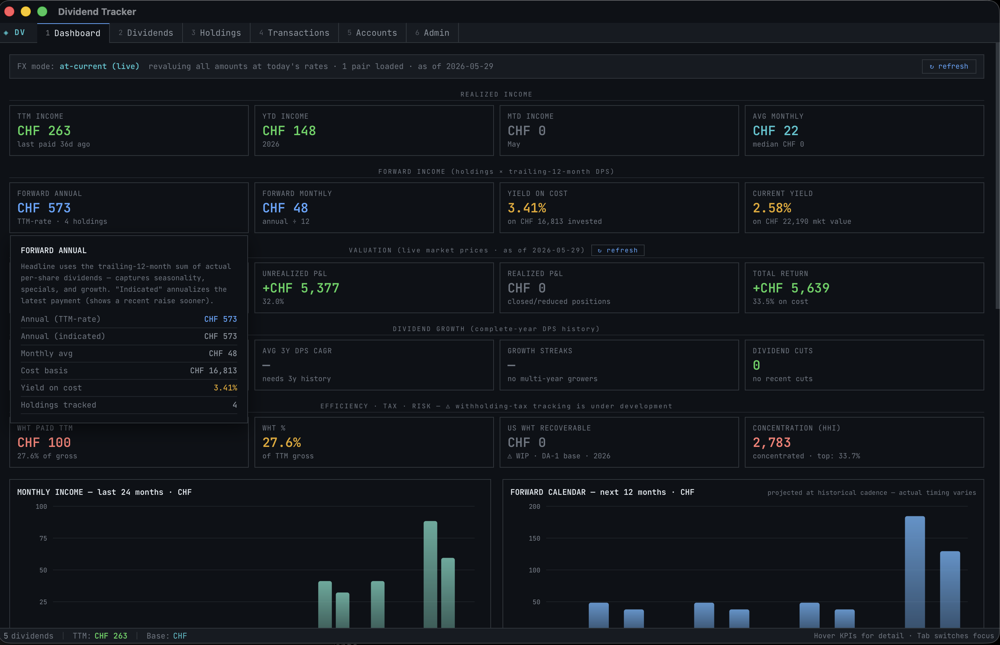
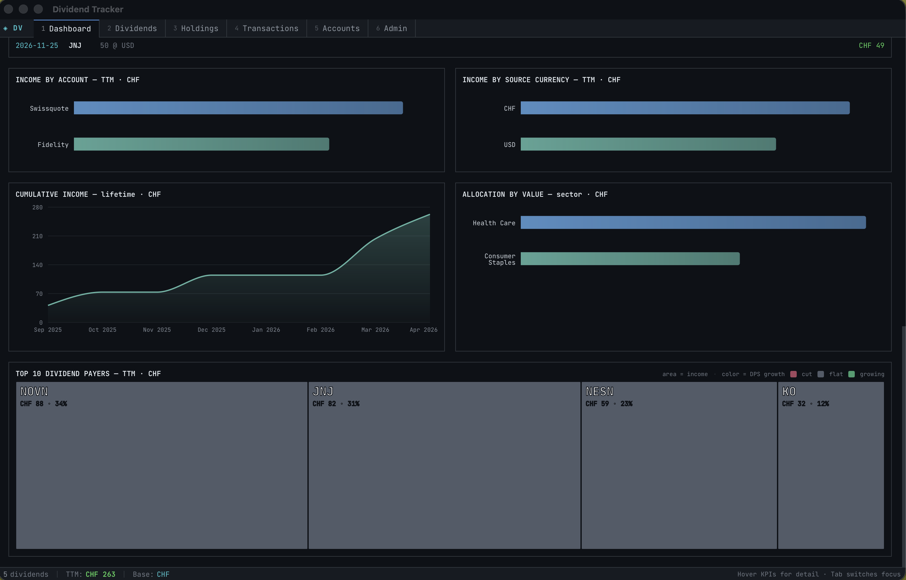
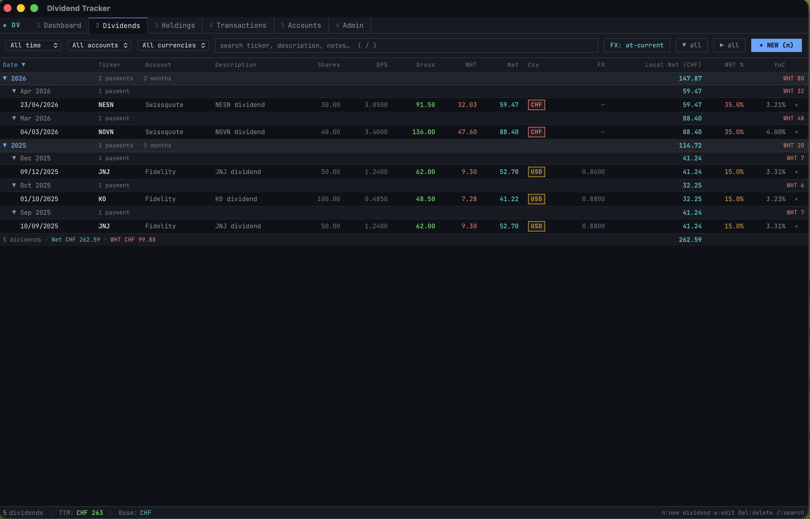
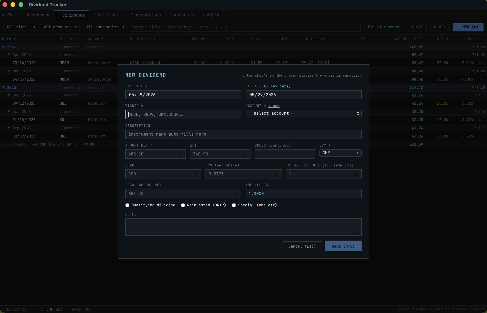
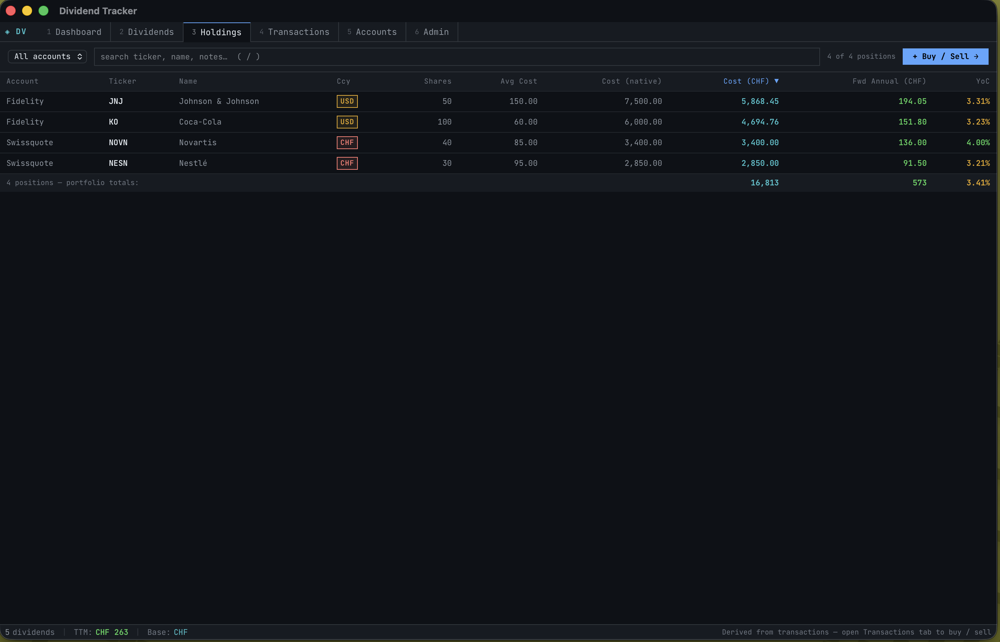
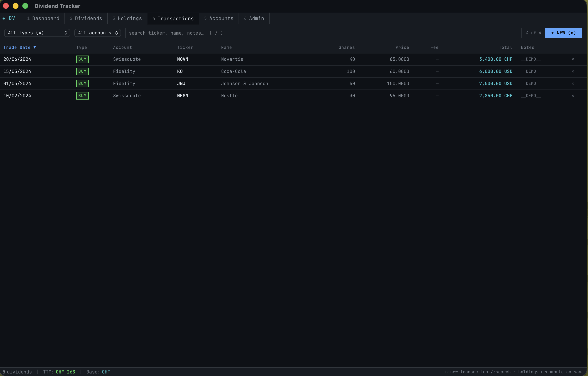
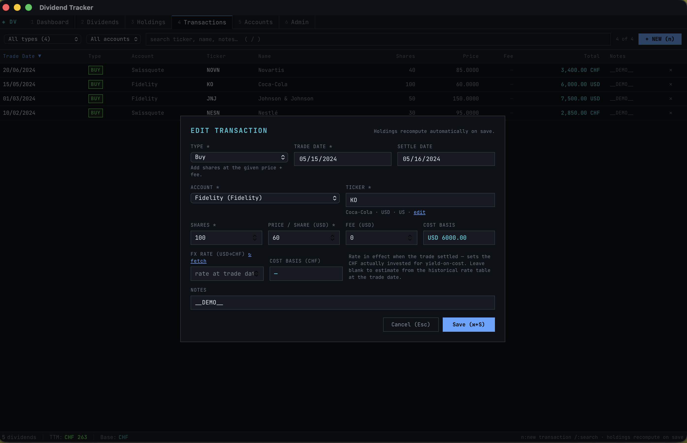
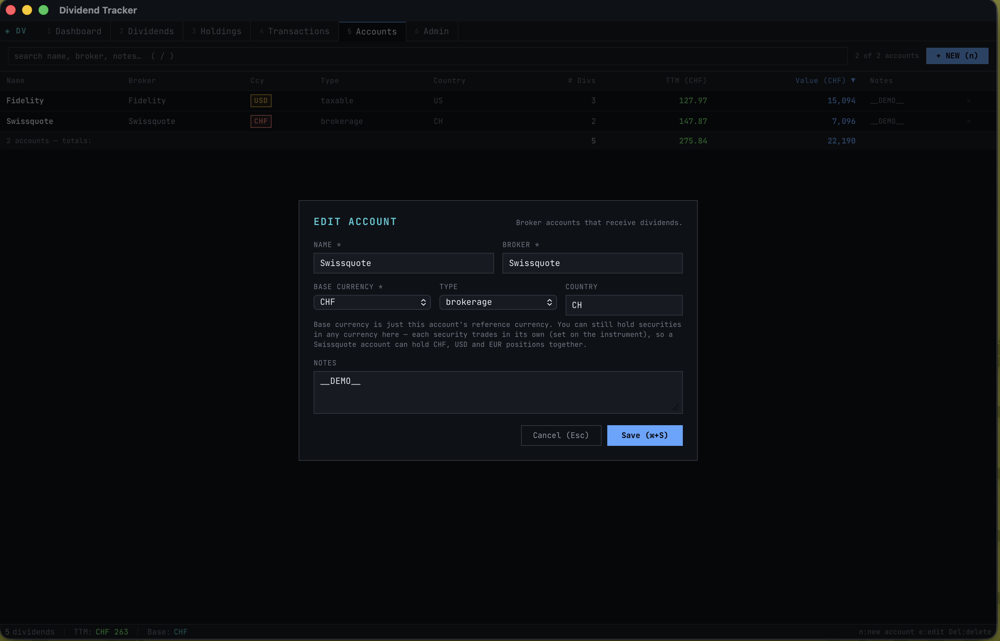
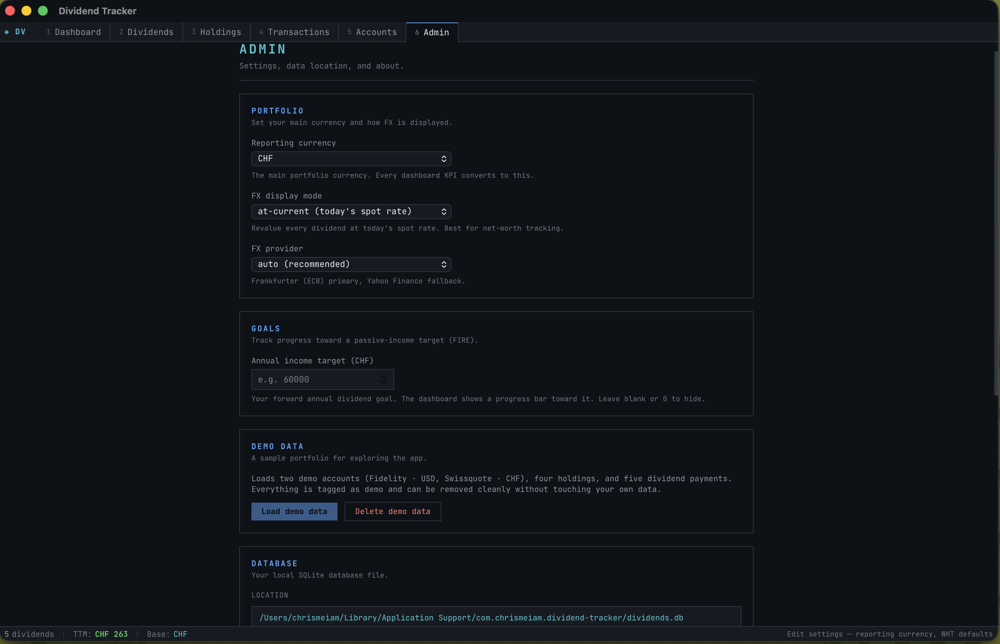

<div align="center">


<br/>
<br/>

# Dividend Tracker

[](https://github.com/leviceroy/Dividend-Tracker)

<br/>

<!-- Project Health -->


<!-- Tech / Platform -->


[-525B68?style=flat)](EULA.md)

<br/>

[](https://github.com/leviceroy/Dividend-Tracker/releases/latest)

<br/>

**Explore:** [Features](#features) · [Screenshots](#screenshots) · [Download](#download--install) · [Manual](MANUAL.md) · [Roadmap](ROADMAP.md) · [FAQ](#faq)

<br/>



</div>

---

> [!IMPORTANT]
> **Dividend Tracker is Bloomberg for dividend investors — on your Mac.**
>
> A serious, local-first dividend journal: every payment, every position, every account,
> every currency — analyzed with decision-grade accuracy. Live prices, forward income on a
> trailing-12-month DPS basis, yield-on-cost on the capital actually invested, dividend
> CAGR & growth streaks, splits & DRIP handled correctly, FIRE income target — and your
> data never leaves your machine.
>
> **Free during the beta.** **[⬇️ Download the .dmg →](https://github.com/leviceroy/Dividend-Tracker/releases/latest)**
>
> First launch on macOS: right-click the app → **Open** → **Open** (not Apple-notarized yet).

<div align="center">

# Your entire dividend life, in one local-first command center.

</div>

## Why Dividend Tracker

- **Local-first and private.** Your portfolio lives in a single SQLite file on your Mac.
  No accounts, no cloud, no broker logins, no telemetry. Back it up like any other file.
- **Built for the multi-account, multi-currency reality.** Track Fidelity USD next to a
  Swiss broker in CHF; convert with live ECB rates *or* the historical pay-date rate; see
  the same number consistently across every tab.
- **Decision-grade accuracy.** Forward income on the *trailing-12-month DPS sum* (not a
  single payment × frequency, the trap most trackers fall into). Yield-on-cost on the
  reporting currency actually invested (FX at purchase), not today's spot applied to old
  costs. Splits, special dividends, and DRIP handled the way an analyst would.
- **A serious income command center.** Live valuation, current yield, unrealized & realized
  P&L, total return, CAGR, growth streaks, cut detection, concentration, FIRE-target
  progress, an upcoming-ex-date calendar — all in one dense, dark dashboard.

## Features

### 📊 Dashboard — the income command center

KPI rows for **realized income** (TTM/YTD/MTD), **forward income** (annual + indicated,
gross / net of WHT), **valuation** (market value, unrealized & realized P&L, total
return), **dividend growth** (CAGR, streaks, cuts), **quality** (Chowder, 5y DGR,
payout ratio, FCF coverage), **efficiency / tax / risk** (concentration HHI, WHT %,
recoverable US WHT, Safety Score) — every card click-expandable for the formula and
per-ticker contributor stats.

<p align="center"></p>

Plus a **FIRE timeline** with monthly-contribution projection, a **benchmark comparison**
strip vs SPY / VYM / SCHD / SSMI, breakdowns by account and source currency, lifetime
cumulative-income curve, sector allocation, a **trajectory** chart (yield-on-cost +
forward income over 36 months), an **income drawdown** + **total-return drawdown** chart,
an **ex-date heatmap** (78 weeks back, 26 ahead), and the Top-10 dividend-payer
**heatmap** (area = income, color = DPS growth).

<p align="center"></p>

**Make it yours.** Hit **⚙ customise** on the FX banner to hide widgets you don't care
about; drag the **⋮⋮** handle to reorder. The grid auto-fits to your window: panels
pack 2 or 3 across on a wide monitor, single-column on a narrow one — no breakpoints to
configure.

### 💸 Dividends — the income ledger

Every payment in a year/month tree with totals: gross, withholding, net, FX rate,
reporting-currency local net, effective WHT %, and per-row YoC (split-adjusted).

<p align="center"></p>

The entry form auto-fills shares, DPS, FX, and ex-date when possible, with flags for
qualifying / DRIP / special. Reinvested dividends with a price create the share-accruing
"buy" automatically.

<p align="center"></p>

### 🏦 Holdings — what you own, what it pays

Per-position view: native + reporting cost (FX at purchase), forward annual income, YoC.
Sortable; portfolio totals in the footer.

<p align="center"></p>

### 🔁 Transactions — the source of truth

Buys, sells, opening balances, **stock splits**, and DRIP-generated buys, all in one
ledger. Holdings derive from this via weighted-average cost. Splits scale shares and WAC
correctly so cost basis stays intact.

<p align="center"></p>

The transaction form supports T+1 settle-date auto-fill on the correct market calendar
(US NYSE / Swiss SIX, holidays included) and an FX-rate-at-trade field with one-click
historical fetch — so cost basis reflects what you actually invested in your reporting
currency.

<p align="center"></p>

### 🏛 Accounts — per-broker rollup

Each broker account with currency, TTM income, and live market value of its holdings.
Default-sorted by value.

<p align="center"></p>

### ⚙️ Admin — preferences, demo data, updates

Reporting currency, FX display mode (at-current vs at-transaction) and provider, FIRE
income target, **demo-data load/delete**, the database file location, in-app updates, and
release notes.

<p align="center"></p>

### And…

- **Multi-currency**, with two display modes: **at-current** (live ECB / Yahoo rates) for
  net-worth tracking, **at-transaction** (pay-date rate) for tax reporting.
- **Splits, special dividends, DRIP** — modeled correctly, not approximated.
- **Auto-updates** — the app checks for new signed releases on launch and offers an
  in-place update with release notes.
- **Universal binary** — runs natively on Apple Silicon and Intel.

## Screenshots

<p align="center">
  
  
</p>
<p align="center">
  
  
</p>
<p align="center">
  
  
</p>
<p align="center">
  
  
</p>

## Download & Install

Grab the latest **`.dmg`** from
[**Releases**](https://github.com/leviceroy/Dividend-Tracker/releases/latest).
Universal build — Apple Silicon and Intel.

1. Open the `.dmg` and drag **Dividend Tracker** to `/Applications`.
2. First launch: **right-click → Open → Open** (the app isn't Apple-notarized yet, so
   Gatekeeper warns).
   Or, from the terminal:
   ```
   xattr -dr com.apple.quarantine "/Applications/Dividend Tracker.app"
   ```

The app starts with an **empty database** (per user, under
`~/Library/Application Support/com.chrismeiam.dividend-tracker/`). Pop into **Admin → Load
demo data** to explore with a sample portfolio before entering your own.

## Updates

The app checks the public release feed on launch and prompts to install a newer signed
version (verifies a cryptographic signature, downloads, installs, relaunches). You can
trigger a check anytime from **Admin → Check for updates** — and read the release notes
from **Admin → Release notes**.

## Try it instantly

**Admin → DEMO DATA → Load demo data** seeds two sample accounts (Fidelity USD,
Swissquote CHF), four holdings (JNJ, KO, NESN, NOVN), and five recent dividend payments
so every tab fills with realistic numbers immediately. **Delete demo data** removes
exactly those rows — your own data is never touched. Loading is blocked once you've
entered real transactions.

## Recently shipped

The v0.8.x arc widened the Dashboard into a customisable analyst surface and
landed the dividend-quality lens the app was missing:

- **Dividend Safety Score (open formula, no subscription)** — 0–100 read per
  holding from streak, payout ratio, FCF coverage, debt/equity, earnings growth.
  Every weight documented; ETFs and funds skipped cleanly.
- **Quality KPI row** — Chowder Number, income-weighted 5y DGR, payout ratio,
  FCF coverage — each click-through detail panel explains the formula and the
  threshold band.
- **Benchmark comparison** — portfolio vs SPY / VYM / SCHD / SSMI: 1y total
  return, current yield, 3y DGR, with spread.
- **Aristocrat / King / Achiever / Contender badges** with portfolio income-share
  by class.
- **Trajectory chart** (YoC + forward income over 36 months) · **drawdown chart**
  (income + total return) · **ex-date heatmap** (78 weeks back, 26 ahead) ·
  **FIRE timeline** with monthly-contribution projection.
- **Per-ticker drill page** — full dividend history, growth, fundamentals,
  positions across accounts, free-form research notes.
- **Customisable dashboard** — hide/show widgets via the ⚙ customise panel; drag
  the ⋮⋮ handle to reorder; layout auto-fits to viewport width (panels pack
  side-by-side when there's room, stack when there isn't).
- **Command palette (⌘K)** — global fuzzy navigation across tabs, dialogs, and
  actions.
- **CSV export** for Dividends / Holdings / Transactions / Accounts.
- **Allocation by market value** — sector and geography lenses sit alongside
  the income-weighted allocation, so "where is my money concentrated" is
  answerable from the dashboard.
- **Reinvestment simulator** — counterfactual overlay: pick 1Y / 3Y / 5Y / All
  and see the actual cumulative income curve next to "what if every dividend
  since then had been DRIP'd into the same ticker?" The widening gap
  visualises the compounding effect with the delta in the header.
- **Undo toasts** on the heavy-traffic tables · **per-jurisdiction treaty WHT
  rates** · **user-configurable yield band thresholds**.

## Coming next

A focused build queue, in the order it'll land. The roadmap is open — see
**[How to vote](#how-to-vote)** below.

#### 1. Broker CSV import — Schwab · Fidelity · IBKR · Swissquote · UBS

Stop typing dividends by hand. Drop in a broker CSV, map the columns once, and
the app dedups the rest. This is the biggest day-one friction, so it lands
first.
→ [#9 Broker CSV import](https://github.com/leviceroy/Dividend-Tracker/issues/9)

#### 2. Real declared ex-dates + macOS alerts

Replace the history-projected calendar with broker-declared ex-dates, and
notify you on macOS when an ex-date is coming up or a dividend gets cut /
raised. The current "Upcoming ex-dates" list is projected from history — fine
for most names, wrong for specials and frequency changes. This fixes it
properly.
→ [#3 Declared ex-dividend calendar](https://github.com/leviceroy/Dividend-Tracker/issues/3)

#### 3. Watchlist tab — pre-purchase research dock

A dedicated tab for tickers you don't own yet: yield, DGR, safety score,
fundamentals, your own research notes, side-by-side with Holdings. The "should
I buy this" workbench.
→ [#11 Watchlist tab](https://github.com/leviceroy/Dividend-Tracker/issues/11)

#### 4. Tax-year CSV exports — DA-1 (Swiss) + 1099-DIV (US)

Pre-formatted exports against the WHT-tracking work already in development.
One CSV per tax year, per jurisdiction, ready for your accountant.
→ [#4 Per-jurisdiction tax reports + CSV exports](https://github.com/leviceroy/Dividend-Tracker/issues/4)

#### 5. Live expense ratio + TTM yield per instrument

The two ETF / fund metrics the app currently leaves blank. Yahoo / issuer
fact sheet pull at refresh time, surfaced on Holdings + the drill page.
→ [#2 Live expense ratio + TTM yield per instrument](https://github.com/leviceroy/Dividend-Tracker/issues/2)

**After those**, in priority order: Windows build (#5) · iOS / iPad read-only
companion (#15) · encrypted iCloud backup · WHT-tracking general availability
(#1). The full backlog lives in [ROADMAP.md](ROADMAP.md) and the
[open roadmap issues](https://github.com/leviceroy/Dividend-Tracker/issues?q=is%3Aopen+is%3Aissue+label%3Aroadmap+sort%3Areactions-%2B1-desc).

### How to vote

Want a feature higher up? **Reactions are the vote.** Open the issue, click
the smiley (😀) button at the top-right of the issue body, and pick 👍. The
[roadmap is sorted by 👍 count](https://github.com/leviceroy/Dividend-Tracker/issues?q=is%3Aopen+is%3Aissue+label%3Aroadmap+sort%3Areactions-%2B1-desc) — the most-voted items get prioritised. Comments are welcome
too, but reactions are what move the priority needle.

Found a bug or have an idea that isn't tracked yet? Open an
[issue](https://github.com/leviceroy/Dividend-Tracker/issues/new/choose).

## FAQ

**Is my data private?** Yes. It lives in a single SQLite file on your Mac. No accounts,
no cloud, no broker connection.

**Does it connect to my broker?** No. You enter buys, sells, splits, and dividends
yourself (the demo data shows the shape). The app fetches **public** market prices,
exchange rates, and historical dividend events from Yahoo / Frankfurter (ECB).

**Does it run on Intel Macs?** Yes — universal build.

**Windows?** Planned. The Tauri stack supports it; not built yet.

**Is it really free?** Free during the beta. A yearly subscription is planned later;
existing installs will keep working.

**Does it give financial or tax advice?** No. It's an informational tool. Verify any
figure before relying on it for trades or taxes — see the [EULA](EULA.md).

## License

Proprietary — see the [EULA](EULA.md). The Software is licensed, not sold;
redistribution and reverse engineering are not permitted.

---

<div align="center">

© 2026 Chris Wenk. All rights reserved.

</div>
